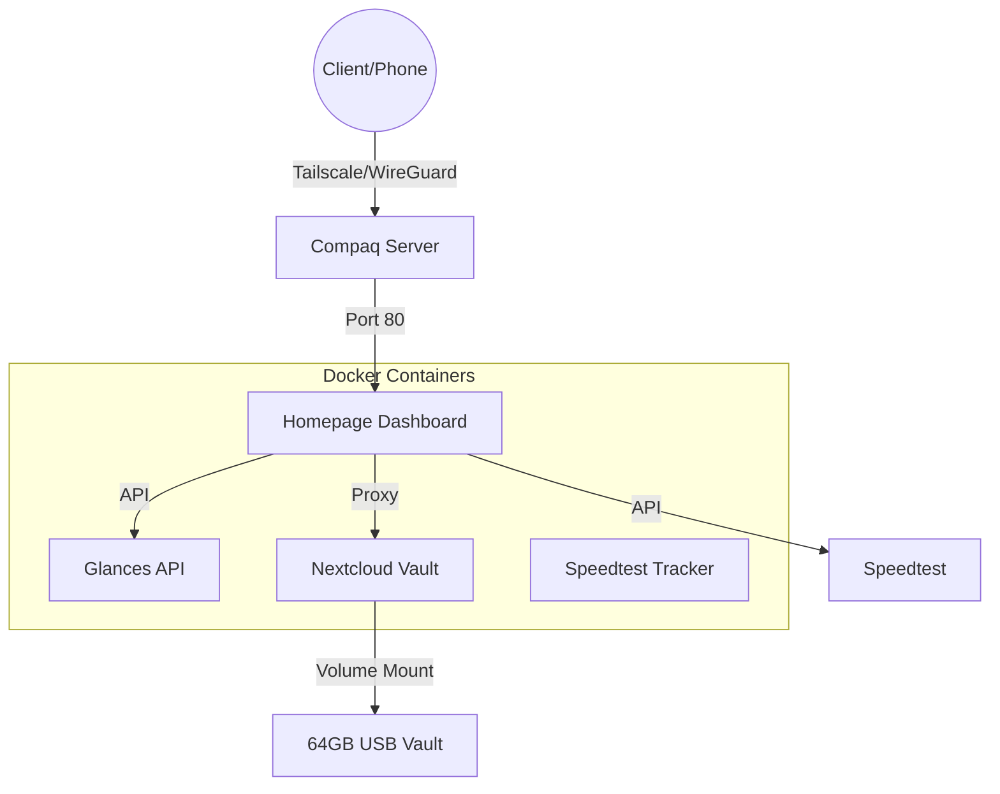

# Command Center | Self-Hosted Dashboard

A lightweight, containerized dashboard built for resource-efficient management of self-hosted services. Designed for deployment on vintage hardware (Compaq) with a focus on Infrastructure as Code (IaC) principles.

## 🏗️ Architecture Diagram



## 🚀 Features
* **Resource Optimized:** Telemetry via headless Glances API, minimizing overhead on leagacy hardware.
* **Infrastructure as Code:** Fully deployable stack using Docker Compose.
* **Secure Access:** Network layer secured via Tailscale, sensitive configurations handled via environment variables.
* **Automated Analytics:** Continuous background network monitoring and historical bandwidth graphing via Speettest Tracker.
* **Custom UI:** Tailored CSS for a cohesive, modern user experience.

## 🛠️ Tech Stack
* **Orchestration:** Docker Compose
* **Dashboard Platform:** Homepage(Liscened under GPL-3.0)
* **Monitoring:** Glances
* **Connectivity:** Tailscale
* **Network Analytics:** Speedtest Tracker

## ⚙️ Deployment
1. Clone the repository:
```bash
git clone https://github.com/TingRongYou/SelfHostedCommandCenter.git
cd Homepage
```
2. Configure Secrets:
Copy the example and populate your environment variables:
```bash
cp homepage/config/secrets.env.example homepage/config/secrets.env
nano homepage/config/secrets.env
```
4. Deploy:
```bash
sudo docker compose up -d
```

## 🛡️ Security
This project is designed for private, self-hosted environments. 
- No public web exposure of services.
- Sensitive environment variables are managed locally via `secrets.env` and excluded from source control.
- Tailscale is recommended for secure, remote access.

## ⚖️ Licensing & Credits
* This project utilizes the [Homepage](https://github.com/gethomepage/homepage.git) platform, which is licensed under the **GNU General Public License v3.0**.
* Architecture design and custom CSS overrided.
